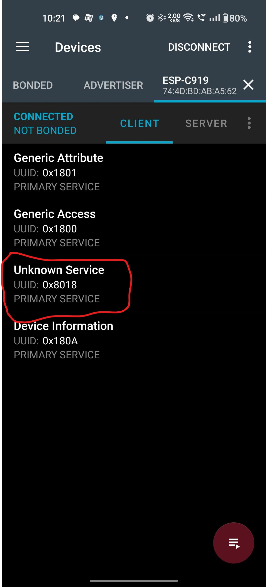
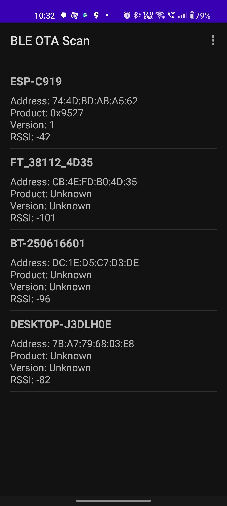
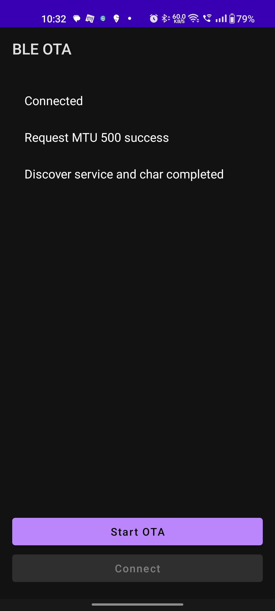
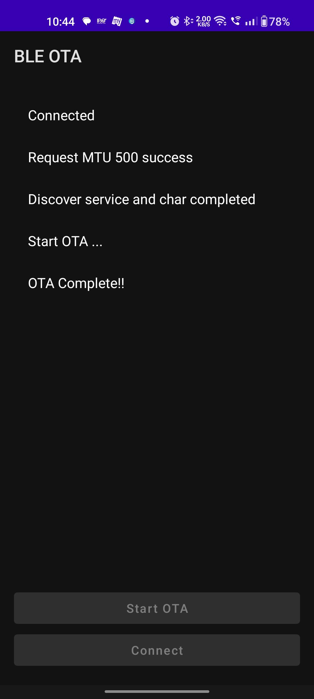

# ESP32 BLE DFU (Device Firmware Update) – Quick User Guide

This document describes the **minimal and mandatory steps** required to perform a BLE-based DFU (OTA firmware update) on an ESP32 device.

The DFU process will **only work if the required BLE DFU service is present and verified first**.

---

## 1. Prerequisites

Before starting, ensure the following:

- ESP32 device is powered ON and running DFU-capable firmware
- BLE is enabled on the device
- Firmware `.bin` file is available
- **nRF Connect (Mobile or Desktop)** installed
- **BLE OTA SCAN (Mobile app from Documents folder)** installed

---

## 2. Verify DFU Service Using nRF Connect (Mandatory Step)

⚠️ **DFU will NOT work unless the DFU service is visible first**

### Steps:

1. Open **nRF Connect**
2. Scan for nearby BLE devices
3. Connect to your ESP32 device
4. Navigate to **Services**
5. Verify the presence of the following DFU service:

```
0x8018
```



### Expected Result:

- DFU service **0x8018** must be visible
- If this service is **not present**, DFU cannot be started, try other device.

❌ **If 0x8018 is missing**  
→ Stop here  
→ Look into another device

✅ **If 0x8018 is present**  
→ Proceed to DFU update

---

## 3. Launch DFU Executable Tool

1. Go to the git repo and Navigate to:

```
Documents/
```

2. Locate the DFU executable file:

```
BLE OTA Scan.exe
```
---

## 4. Scan and Select ESP32 Device

1. In the DFU tool, click **Scan**
2. Wait for nearby BLE devices to appear
3. Select your ESP32 device from the list

✔ Ensure the selected device matches the one verified in **nRF Connect**

Here in my case my device name is ESP-C91



---

## 5. Select Firmware (.bin) File

1. select your device name and it will ask for select folder.
2. Loacte your .bin file.
---

## 6. Start OTA

1. Click **Start DFU**
2. Wait for the update process to complete



### During Update:
- Do **not** power off the ESP32
- Do **not** close the DFU tool
- BLE connection must remain stable

---

## 7. DFU Completion



### On success:
- DFU tool shows **Update Completed**
- ESP32 device automatically reboots
- New firmware is now active

### On failure:
- Recheck:
  - DFU service (0x8018)
  - BLE connection stability
  - Correct firmware `.bin` file

---

## 8. Summary Flow

```
nRF Connect → Verify DFU Service (0x8018)
        ↓
Launch DFU .exe
        ↓
Scan & Select Device
        ↓
Select .bin File
        ↓
Start OTA
```

---

## Important Notes

- DFU service verification is **mandatory**
- Absence of `0x8018` means DFU is not supported or misconfigured
- Always validate firmware compatibility before update

---

**End of Document**
